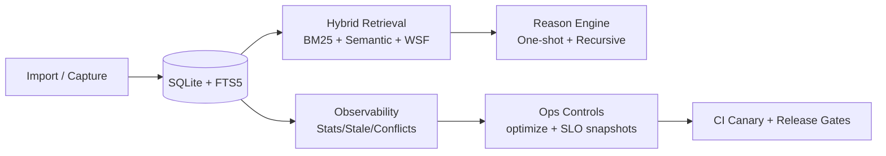

# Cortex: Import-First Agent Memory You Actually Own (Deep Dive)

> Your agent memory should be portable, inspectable, and durable. Cortex is a single-binary, SQLite-backed memory layer with hybrid retrieval, reasoning, observability, and release-grade ops guardrails.

---

## Last Updated

- **Updated:** 2026-02-20 (ET)
- **Repo checked:** `hurttlocker/cortex` @ `9ab5d04` (main)
- **Latest stable release:** `v0.3.4`
- **Current dev fallback version in source:** `0.3.5-dev`

---

## Executive Snapshot

Cortex has moved from “feature buildout” into “operational hardening + release discipline.”

### What is true right now
- Stable release is live: **v0.3.4**
- RC and delta audits were completed before promotion
- Post-release hardening lanes (v0.3.5-dev) are actively shipped on `main`
- Current open issue count: **0** (at time of refresh)

### Most recent merged wave (top commits)
1. `9ab5d04` — SLO canary threshold warn/fail bands (lane 6)
2. `5c6323d` — fix `--cortex-bin` handling in `slo_snapshot.sh`
3. `2bcd23a` — scheduled SLO canary workflow + artifacts (lane 5)
4. `0693413` — release checklist enforcement before GoReleaser (lane 4)
5. `8a224f2` — CI doc/status drift guard for go/no-go docs (lane 3)
6. `be52bba` — SLO snapshot script/report tooling (lane 2)
7. `efd9314` — `cortex optimize` command (lane 1)

---

## Where We Are in the Roadmap (Abstraction-Level View)

## Layer 1 — Core Product (DONE)
Import, extraction, hybrid search, MCP, reasoning, and observability are delivered and in production use.

## Layer 2 — Reliability + Release Readiness (DONE)
The v0.3.4 cycle delivered audit fit, immutable target auditing, release artifact verification, and explicit go/no-go docs.

## Layer 3 — Ops Maturity (IN PROGRESS, HEAVILY ADVANCED)
Most high-impact ops controls are now in place:
- `cortex optimize` maintenance path
- SLO snapshot artifact generation
- CI doc drift guardrails
- Release checklist gating before publish
- Scheduled canary + artifact history
- Thresholded canary regression signaling

## Layer 4 — Next Expansion (NEXT)
Natural next targets are trend-aware regression comparisons, dashboarding, and higher-level memory-quality improvements.

---

## Release State

### Published tags (latest first)
`v0.3.4`, `v0.3.4-rc1`, `v0.3.3`, `v0.3.2`, `v0.3.1`, `v0.3.0`, ...

### Stable release
- **v0.3.4** (non-draft, non-prerelease)
- Cross-platform artifacts + checksums published

### Release process maturity (current)
- CI build/test/vet gates
- PR autofix gate
- Release workflow gate: `scripts/release_checklist.sh`
- Docs drift gate: `scripts/ci_release_guard.sh`

---

## Current System Stats (Live Snapshot)

From `cortex stats --json` on 2026-02-20:

- Memories: **2,448**
- Facts: **2,705,925**
- Sources: **664**
- Storage: **1,482,072,064 bytes (~1.48 GB)**
- Avg confidence: **0.867**
- Alerts:
  - `db_size_notice` (>1.0GB)
  - `fact_growth_spike`
  - `memory_growth_spike`

Interpretation: the system is healthy but in high-growth mode; ops guardrails are correctly surfacing pressure signals.

---

## What Changed Since the Prior Deep Dive (v0.3.3-era)

The prior document anchored to `v0.3.3` / `968954e` and emphasized audit hardening.

Now, beyond that baseline, Cortex added:

1. **Stable promotion to v0.3.4** after audit loop
2. **Null memory_class hardening closure** in search/migrations path
3. **DB maintenance command** (`cortex optimize`)
4. **SLO reporting script** (`scripts/slo_snapshot.sh`)
5. **Scheduled SLO canary workflow** (`.github/workflows/slo-canary.yml`)
6. **Thresholded canary gates** (PASS/WARN/FAIL, warn/fail ms bands)
7. **CI guard against go/no-go doc drift**
8. **Release workflow checklist enforcement** before publish

---

## Ops & Reliability Toolchain (Now Available)

### 1) Built-in maintenance
```bash
cortex optimize
cortex optimize --check-only
cortex optimize --vacuum-only
cortex optimize --analyze-only
```

### 2) SLO snapshot artifact
```bash
scripts/slo_snapshot.sh \
  --warn-stats-ms 3000 --warn-search-ms 5000 --warn-conflicts-ms 5000 \
  --fail-stats-ms 7000 --fail-search-ms 10000 --fail-conflicts-ms 12000 \
  --output /tmp/slo.json --markdown /tmp/slo.md
```

### 3) CI canary (daily + manual)
- Workflow: `.github/workflows/slo-canary.yml`
- Uploads JSON + markdown artifacts per run
- Uses threshold bands for gating

### 4) CI/governance guards
```bash
scripts/ci_release_guard.sh
scripts/release_checklist.sh --tag vX.Y.Z
```

---

## Architecture (Current Practical View)



Cortex is now not just a memory engine — it is a memory engine with release-grade operational controls.

---

## Known Gaps / Honest Next Step

The platform is now strong on correctness and operations. The next strategic unlock is **trend-aware performance regression intelligence** (relative change over time, not only static thresholds), followed by richer UI/analysis surfaces.

---

## Recommended Next Roadmap Slice (Post Lane 6)

1. **Lane 7:** SLO trend comparator (latest vs historical canary artifacts)
2. **Lane 8:** Canary budget checks (cost/tokens where applicable)
3. **Lane 9:** Readme roadmap refresh to reflect shipped lane sequence explicitly
4. **Lane 10:** Dashboarding of canary + drift + release gate history

---

## Bottom Line

Cortex is past the point of “promising memory tool” and into “operational memory platform.”

- Stable release quality: ✅
- Audit discipline: ✅
- Ops guardrails: ✅
- Continuous canarying with thresholds: ✅

The next gains come from trend intelligence and decision UX, not foundational reliability.
