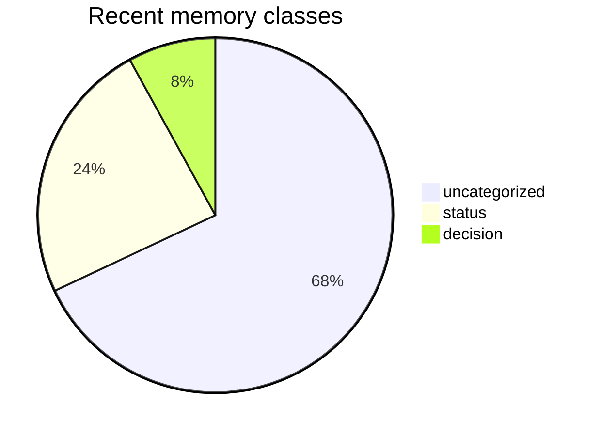
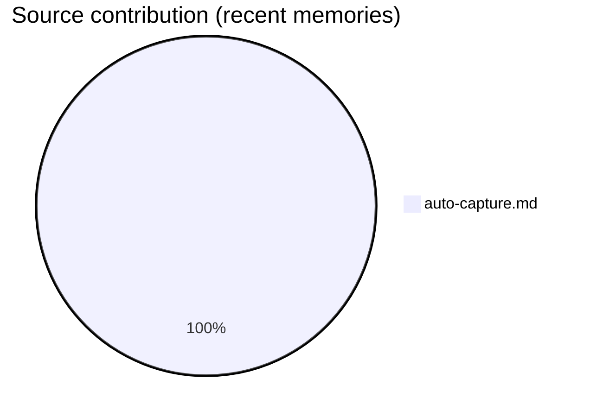
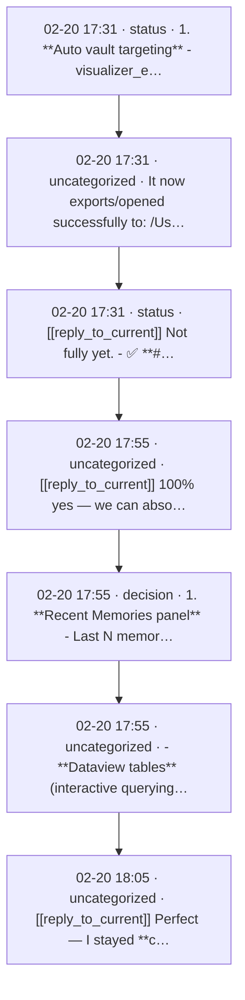
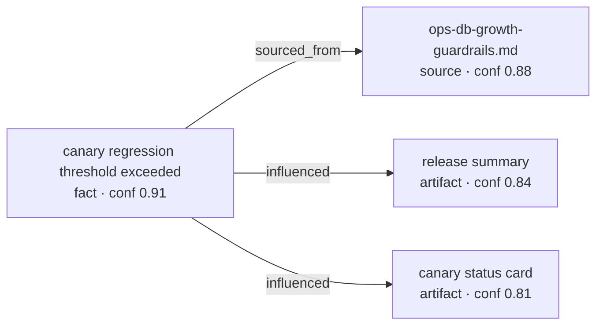
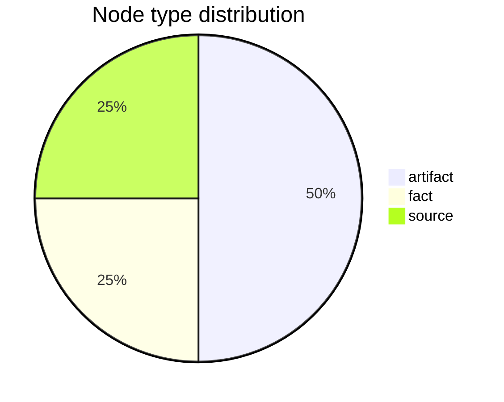

# Cortex Visualizer Dashboard

> Generated: `2026-02-20T18:11:51Z`
> Focus: `fact_canary_regression`
> Bounds: `max_hops=2` · `max_nodes=200`

## Snapshot

- **Release readiness:** `WARN`
- **Memory quality score:** `84/100`
- **Reason p95 latency:** `121.9s`
- **Facts 24h growth:** `1238401`
- **Top actions:** Tighten low-signal ingestion filters and dedupe thresholds for repetitive captures.

## Memory Radar

> [!info] Memory health
> - stale facts: **0**
> - conflicts: **221**

> [!warning] 221 potential fact conflicts detected

### Recent Memories

| Time | Class | Source | Snippet |
|---|---|---|---|
| `02-20 18:05` | `uncategorized` | `auto-capture.md` | Open issues are now only: - #104 (visualizer lane) - #99 (visualizer epic) If you want, I… |
| `02-20 18:05` | `uncategorized` | `auto-capture.md` | - New deterministic end-to-end runtime smoke: - `scripts/connectivity_smoke.sh` - validat… |
| `02-20 18:05` | `uncategorized` | `auto-capture.md` | - ✅ Opened + closed **#117** (core connectivity gate) - ✅ Merged **PR #118**: https://git… |
| `02-20 18:05` | `uncategorized` | `auto-capture.md` | [[reply_to_current]] Perfect — I stayed **completely out of visualization** and kept push… |
| `02-20 17:55` | `uncategorized` | `auto-capture.md` | - **Dataview tables** (interactive querying inside Obsidian) - **Advanced URI plugin** (d… |
| `02-20 17:55` | `decision` | `auto-capture.md` | 1. **Recent Memories panel** - Last N memories with: timestamp, confidence, source, type.… |
| `02-20 17:55` | `uncategorized` | `auto-capture.md` | [[reply_to_current]] 100% yes — we can absolutely show memories here, and make it way mor… |
| `02-20 17:31` | `status` | `auto-capture.md` | [[reply_to_current]] Not fully yet. - ✅ **#102 is done** (merged, issue closed) - 🚧 **#10… |

### Memory Class Mix

### Source Heatmap

### Memory Timeline

### Focus Memory Pack

> [!abstract] Match 1 · score 1.052
> `decision` · `auto-capture.md`
> - Added `scripts/slo_budget_guard.py` - It reads: - `slo-canary.json` (snapshot status + timing) - `slo-trend.json` (regression status vs prior run) - Produces: - `PASS / WARN / F…
>
> [!abstract] Match 2 · score 1.018
> `rule` · `auto-capture.md`
> - Added telemetry guardrails to `codex-rollout-report`: - one-shot p95 latency warning threshold (default `20000ms`) - recursive known-cost completeness warning threshold (default…
>
> [!abstract] Match 3 · score 0.902
> `uncategorized` · `auto-capture.md`
> - Triggered canary manually after fix - Run **passed end-to-end** with artifact upload. If you want, I’ll start **lane 6** now: make canary enforce configurable timing thresholds…
>
> [!abstract] Match 4 · score 0.886
> `status` · `auto-capture.md`
> - No open issues right now (I checked live issue list) - Main is at: `9ab5d04` (latest merge) --- If you want, I’ll draft **Lane 7** immediately as: **“SLO trend comparator”** (co…
>
> [!abstract] Match 5 · score 0.880
> `uncategorized` · `auto-capture.md`
> - `main` at `674463b` - Open issues: **none** If you want, I’ll start the next lane now: **SLO trend comparator** (compare latest canary artifact vs prior runs and flag regression…
>

### Conflict Watchlist

- `Conversation Summary` → attribute: [messageid=588] vs [messageid=585]
- `Conversation Summary` → attribute: [messageid=588] vs [messageid=591]
- `Conversation Summary` → attribute: [messageid=588] vs [messageid=590]
- `Conversation Summary` → attribute: [messageid=588] vs [messageid=582]
- `Conversation Summary` → attribute: [messageid=588] vs [messageid=585]

## Graph (Mermaid)

## Node Type Mix

## Node Directory

| Node | Type | Confidence | Source |
|---|---:|---:|---|
| `fact_canary_regression` | fact | 0.91 | `docs/ops-db-growth-guardrails.md` |
| `src_ops_guardrails` | source | 0.88 | `docs/ops-db-growth-guardrails.md` |
| `artifact_release_summary` | artifact | 0.84 | `docs/releases/v0.3.4.md` |
| `artifact_canary_card` | artifact | 0.81 | `docs/CORTEX_DEEP_DIVE.md` |

## Node Drilldown

### canary regression threshold exceeded

- id: `fact_canary_regression`
- type: `fact`
- source: `docs/ops-db-growth-guardrails.md`
- links: `canary status card`, `release summary`, `ops-db-growth-guardrails.md`

### ops-db-growth-guardrails.md

- id: `src_ops_guardrails`
- type: `source`
- source: `docs/ops-db-growth-guardrails.md`
- links: `canary regression threshold exceeded`

### release summary

- id: `artifact_release_summary`
- type: `artifact`
- source: `docs/releases/v0.3.4.md`
- links: `canary regression threshold exceeded`

### canary status card

- id: `artifact_canary_card`
- type: `artifact`
- source: `docs/CORTEX_DEEP_DIVE.md`
- links: `canary regression threshold exceeded`

